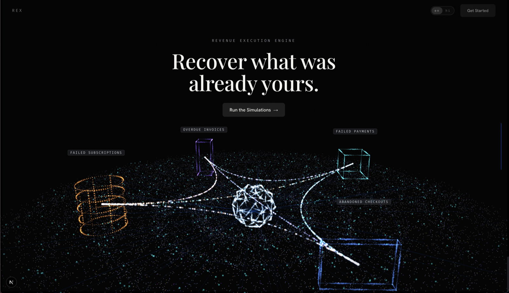
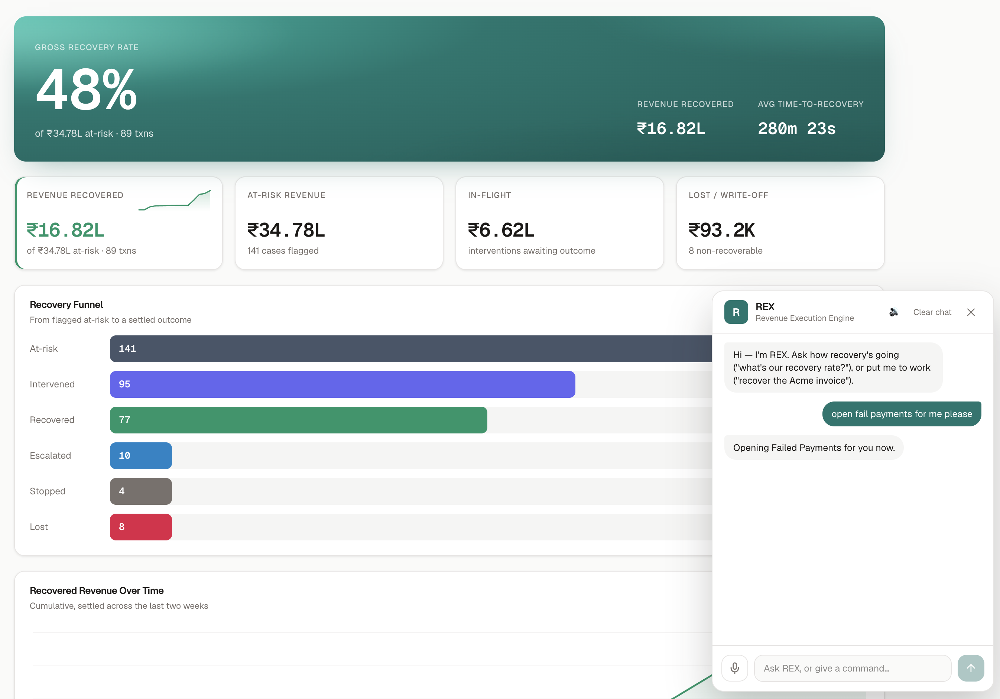
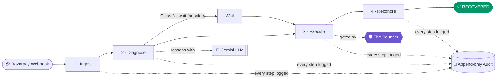
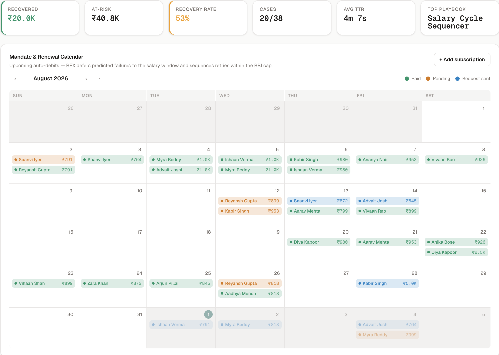
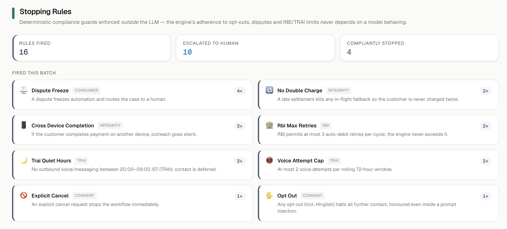
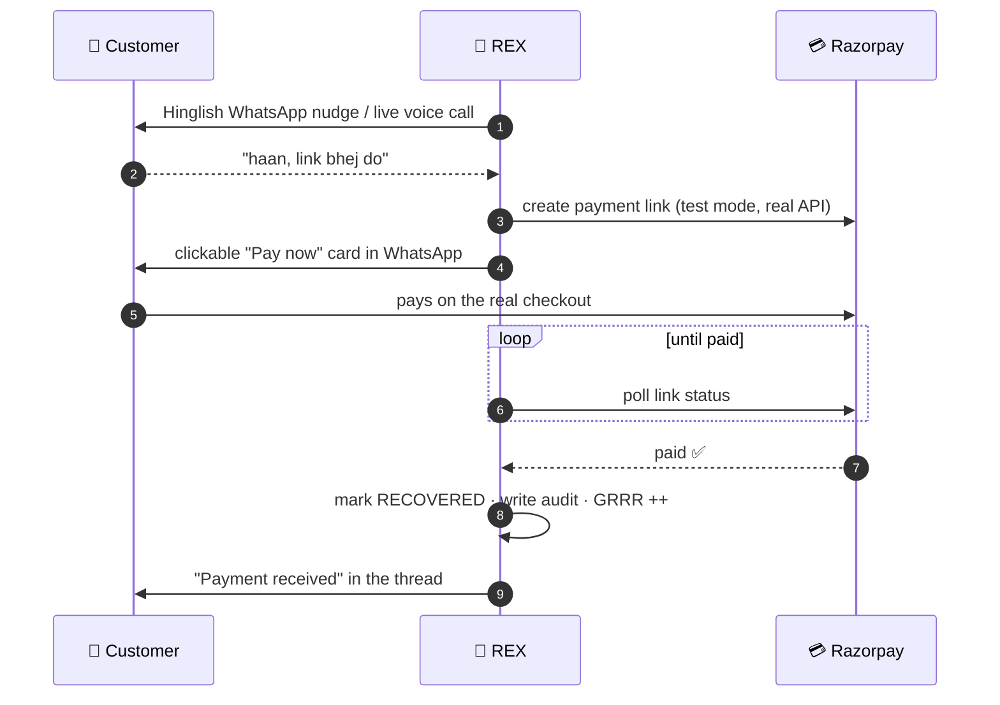
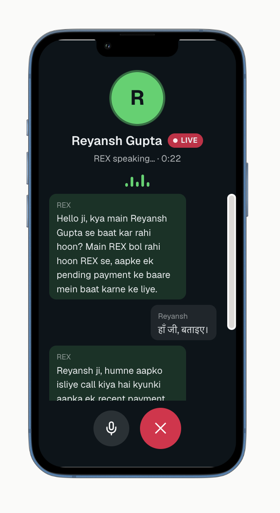
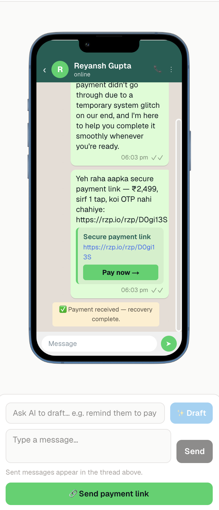
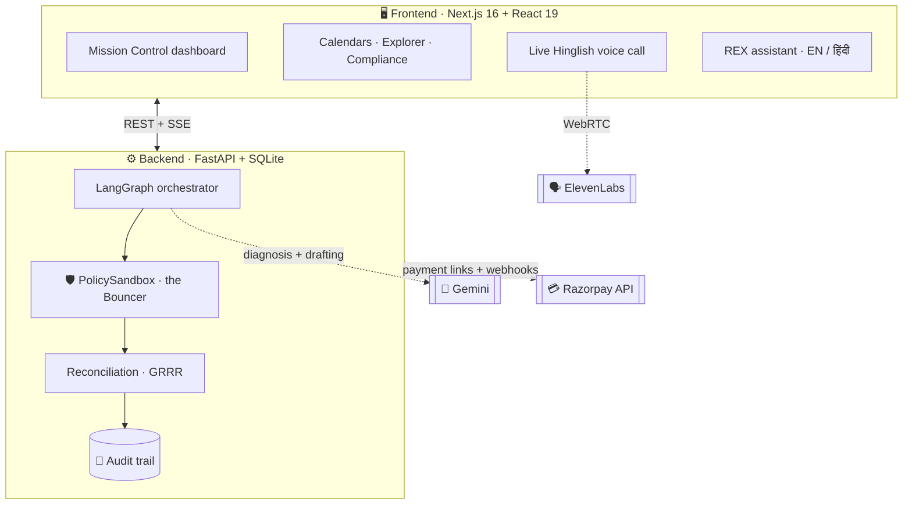

<div align="center">

# 🧠 REX · Revenue Execution Engine

### An autonomous, compliant, bilingual agent that recovers failed payments and *proves* it did so within the rules.

<br>

**[The Problem](#-the-problem)** · **[The Solution](#-the-solution)** · **[Four Shapes](#-the-problem-in-four-shapes)** · **[The Bouncer](#-recovery-you-can-trust)** · **[The Money Moment](#-the-money-moment)** · **[Architecture](#%EF%B8%8F-architecture)** · **[Run It](#-running-it-locally)**

<br/>



</div>

<br/>

---

## 🩸 The problem

Indian merchants lose enormous revenue to failed payments. Not to fraud, but to **friction**:
a bank that timed out, a card that expired, an auto-debit that bounced the day before
salary, an invoice that quietly went overdue. Today, recovering it means a human chasing
customers one at a time, in the wrong language on the wrong channel, with no memory of what
is or is not allowed under RBI and TRAI rules.

Most of that revenue already *wanted* to happen. It just needs something to close the loop,
quickly and correctly.

<div align="center">


<br/><sub><i>The landing scene: the four failure classes orbit the engine, each a different shape of lost revenue.</i></sub>
</div>

## ✨ The solution

REX treats recovery as an **autonomous loop with a human in oversight**, not in the driver's
seat. Every failed transaction runs the same four steps:



The headline metric is **GRRR** (Genuine Revenue Recovery Rate): recovered ÷ at-risk,
earned only on genuinely at-risk transactions, and never on a case where no real payment
happened.

---

## 🧩 The problem, in four shapes

Failed payments are not one problem; they are four, and each needs a different solve. REX
classifies every failure **deterministically from the webhook** (not by the LLM, so routing
stays auditable) and runs a dedicated playbook per class.

| | Class | What broke | REX's recovery play |
|:--:|------|------------|------------|
| 🔵 | **Failed Payments** | UPI switch timeout / gateway drop mid-transaction | Re-route to a healthy rail in-flight (`REROUTE_RAIL`), then a secure 1-tap link (`PREAUTH_LINK`) |
| 🟣 | **Abandoned Checkouts** | High-intent drop-off at the OTP / 3DS step | A 1-tap UPI Autopay link on WhatsApp that skips card + OTP (`UPI_AUTOPAY_NUDGE`) |
| 🟡 | **Failed Subscriptions** | E-mandate auto-debit fails on a month-end low balance | Defer the retry to the salary window (`SALARY_CYCLE_SEQUENCER`) + mandate refresh, within the RBI 3-retry cap |
| 🟢 | **Overdue Invoices** | A B2B Net-30 receivable sails past due | Chase on a cadence, extract a hard Promise-to-Pay date from the Hinglish reply, hold dunning until then (`P2P_TRACKER`) |

### A dedicated console for every class

<table>
<tr>
<td width="50%" valign="top">

**🔵🟣 Failed Payments & Abandoned Checkouts**
A transactions explorer with plain-language tags, a **"why" chip** on every case linking
back to the exact audit entry that caused it, and a per-case recovery timeline.

</td>
<td width="50%" valign="top">

**🟡 Failed Subscriptions**
A **Mandate & Renewal Calendar**: a month grid of upcoming auto-debits as pills coloured by
status, where REX defers predicted failures to the salary window. Add a subscription and it
becomes a real, workable case.

</td>
</tr>
<tr>
<td width="50%" valign="top">

**🟢 Overdue Invoices**
A **Receivables Aging board**: invoices bucketed by age, with REX's reminder cadence and
tracked Promise-to-Pay dates. New invoices are backed by real transactions.

</td>
<td width="50%" valign="top">

**🗣️ Everywhere**
A corner **REX assistant** you can ask questions or give commands, in English or Hindi, plus
a **live Hinglish voice call**. Fully bilingual, down to the diagnoses and playbooks.

</td>
</tr>
</table>

<div align="center">

<br/><sub><i>The <b>Mandate &amp; Renewal Calendar</b> (Failed Subscriptions): upcoming auto-debits as status-coloured pills, where REX defers predicted failures to the salary window within the RBI retry cap.</i></sub>
</div>

---

## 🛡️ Recovery you can trust

Recovering revenue is easy if you can spam customers and double-charge cards. REX cannot.
A deterministic policy layer, **the Bouncer**, sits between the agent's intent and any
real-world action, and **the model cannot argue its way past it**.

| Rule | Guard |
|------|-------|
| 🏦 **RBI** | At most 3 auto-debit retries per cycle |
| 🌙 **TRAI** | No outbound contact during quiet hours (20:00 to 09:00 IST) |
| 🔁 **No double charge** | A late settlement voids the fallback |
| 📱 **Cross-device completion** | If the customer pays elsewhere, REX goes silent |
| ⚖️ **Dispute freeze** | An open dispute routes straight to a human |
| ✋ **Opt-out / cancel** | Honoured instantly, even mid-conversation and inside prompt-injection attempts |
| 📵 **Voice-attempt cap** | At most 2 voice calls in 72 hours |

The policy is **operator-editable** from the dashboard, and **REX itself has no write path
to it**. REX does the thinking; the Bouncer holds the line. Everything that clears the
Bouncer, or is stopped by it, is appended to an immutable audit log.

<div align="center">

<br/><sub><i>The Bouncer's stopping rules — RBI retry caps, TRAI quiet hours, dispute freezes, opt-outs — enforced <b>outside</b> the model.</i></sub>
</div>

---

## 💸 The money moment

The part that makes recovery **real** rather than a story: REX mints a genuine Razorpay
payment link (test mode), and the loop closes automatically when it is paid.



> Inbound webhooks cannot reach a local machine, so the paid state is reconciled by
> **polling** the link status. The loop closes reliably in a local demo, no tunneling.

<div align="center">

&nbsp;&nbsp;

<br/><sub><i>Left: a live Hinglish voice call with REX. Right: the real, clickable Razorpay "Pay now" card, then <b>"Payment received — recovery complete."</b></i></sub>
</div>

---

## 🏗️ Architecture



- **Backend:** FastAPI, SQLAlchemy, SQLite. A LangGraph orchestrator runs the recovery DAG;
  a plain-Python `PolicySandbox` enforces compliance; Gemini powers diagnosis, drafting, and
  the assistant, each with a **deterministic fallback** so nothing hard-fails offline.
- **Frontend:** Next.js 16, React 19. A Mission Control dashboard with a GRRR hero + recovery
  funnel, a transactions explorer, per-class pages, escalations, a compliance view, an
  editable policy inspector, and the two calendar trackers. Fully bilingual.
- **Voice:** ElevenLabs Conversational AI over WebRTC inside the phone frame, with the
  browser's speech synthesis as a fallback.

---

## 🚀 Running it locally

<details open>
<summary><b>Backend</b> (Python 3.12)</summary>

```bash
cd backend
python -m venv .venv && source .venv/bin/activate
pip install -r requirements.txt
cp .env.example .env    # add your keys (see below); it also runs offline without them
python -m uvicorn app.main:app --port 8000
curl -X POST http://localhost:8000/api/v1/admin/seed   # populate the demo dataset
```

Optional keys in `backend/.env`:
- `gemini_api_key` for live diagnosis and drafting (falls back to templates offline)
- `RAZORPAY_KEY_ID` / `RAZORPAY_KEY_SECRET` (test keys) for real payment links
- `elevenlabs_api_key` for the assistant's spoken replies

</details>

<details>
<summary><b>Frontend</b> (Node 20+)</summary>

```bash
cd frontend
npm install
echo "NEXT_PUBLIC_ELEVENLABS_AGENT_ID=your_agent_id" > .env.local   # for the live call
npm run dev            # http://localhost:3000/mission-control
```

The frontend talks to `http://localhost:8000` by default; override with `NEXT_PUBLIC_API_BASE`.

</details>

<details>
<summary><b>Tests</b> and the full recovery arc</summary>

```bash
cd backend && .venv/bin/python -m pytest -q     # full suite, 213 tests
cd frontend && npm run build                    # type-check + production build
```

To see the whole arc, send a payment link from a transaction, pay the test link with card
`4111 1111 1111 1111` (any future expiry and any CVV), and watch the case flip to `RECOVERED`.

</details>

---
<div align="center">

## 🏆 Why this wins

REX is built on Razorpay's own primitives (webhooks, payment links, mandates), with real
signature verification and a real payment API. It speaks Hindi and English, takes voice and
chat commands, recovers revenue while a human sleeps, and can prove, on an append-only trail,
that every rupee was recovered within the rules.

### Failed payments are not lost payments. They are just waiting for REX.

</div>
